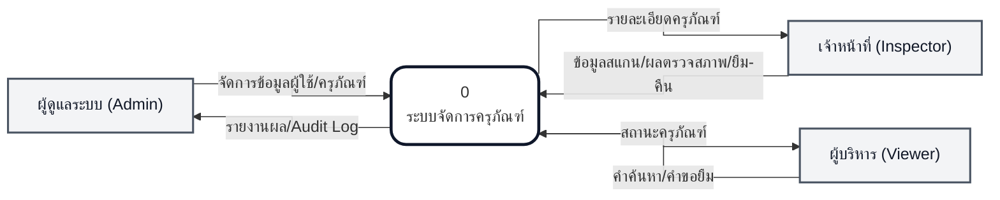
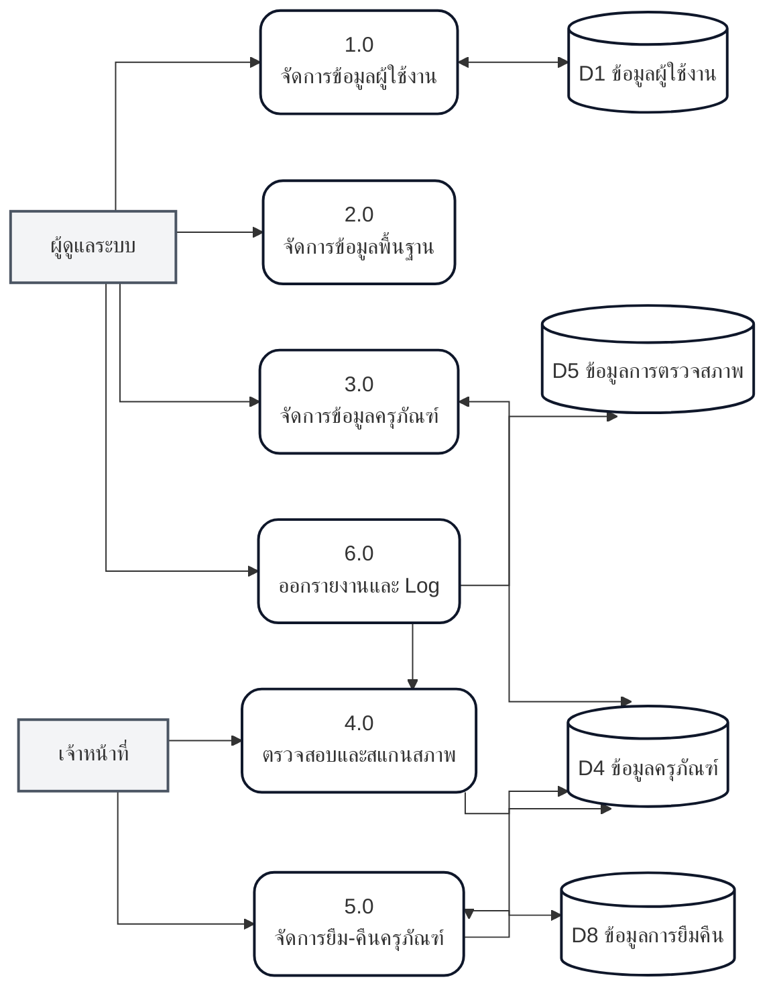
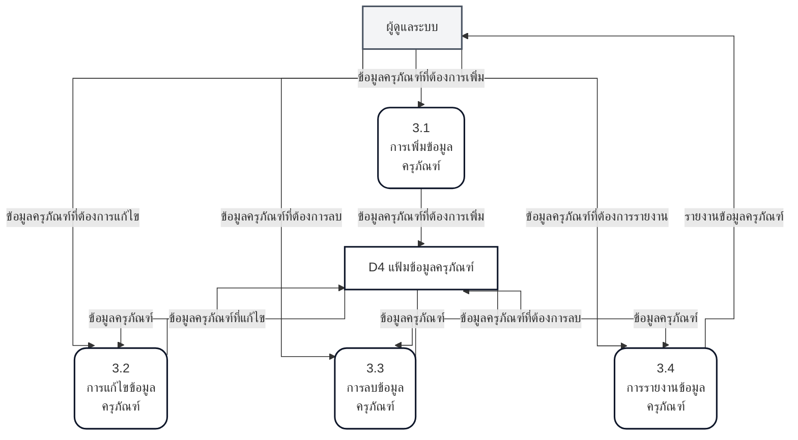
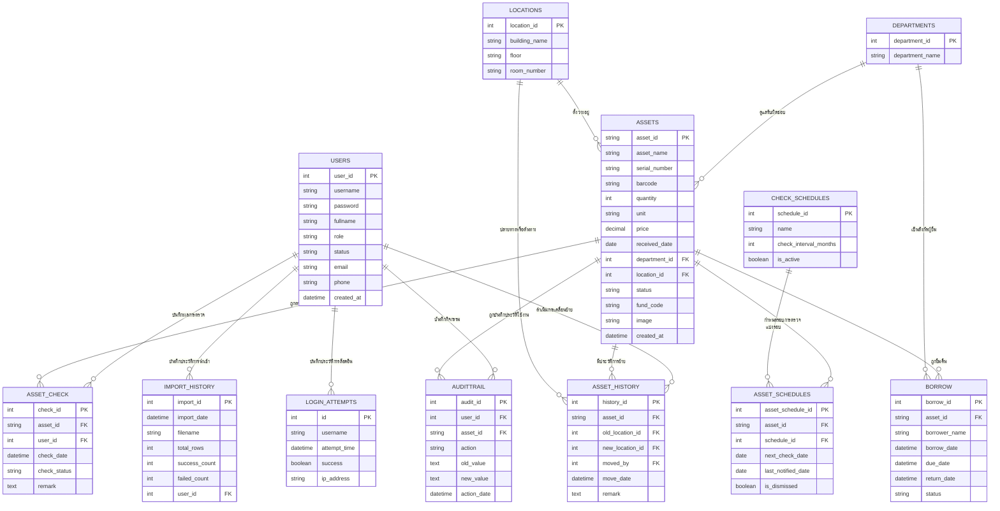

<h1>บทที่ 3</h1>
<h2>การวิเคราะห์และออกแบบระบบ (System Analysis and Design)</h2>
 

---

ในบทนี้จะกล่าวถึงขั้นตอนการวิเคราะห์ความต้องการของระบบบริหารจัดการครุภัณฑ์ การออกแบบแผนภาพบริบท (Context Diagram) แผนภาพการไหลของข้อมูล (Data Flow Diagram) คำอธิบายการประมวลผล (Process Specification) และการออกแบบฐานข้อมูล (Database Design) เพื่อให้ระบบสามารถตอบสนองความต้องการของผู้ใช้งานได้อย่างมีประสิทธิภาพ

## 3.1 แผนภาพบริบท (Context Diagram)

Context Diagram แสดงภาพรวมความสัมพันธ์ระหว่างระบบกับหน่วยงานภายนอก (External Entities)

---

## 3.2 แผนภาพการไหลของข้อมูลระดับที่ 0 (DFD Level 0)

แสดงกระบวนการทำงานหลักทั้ง 6 กระบวนการ

---

## 3.3 แผนภาพการไหลของข้อมูลระดับที่ 2 (DFD Level 2)

### 3.3.1 DFD Level 2 of Process 3.0 จัดการข้อมูลครุภัณฑ์

---

## 3.4 การไหลของข้อมูล (Data Flow Description)

ตารางแสดงรายละเอียดการไหลของข้อมูลระหว่างหน่วยประมวลผล (Process) และแหล่งเก็บข้อมูล (Data Store) ครอบคลุมเส้นทางข้อมูลหลักในระบบ

#### ตารางที่ 3-1 แสดง Data Flow ข้อมูลครุภัณฑ์ (Asset Info)
| หัวข้อ | รายละเอียด |
|:--- |:--- |
| **Data Flow ID :** | 0001 |
| **Name :** | ข้อมูลครุภัณฑ์ |
| **Description :** | รายละเอียดทางเทคนิคและสถานะของครุภัณฑ์ |
| **Source :** | เจ้าหน้าที่, ผู้ดูแลระบบ |
| **Destination :** | Process 3, 4, 5, 6, Data Store 4 (Assets) |
| **Data Structure :** | ข้อมูลครุภัณฑ์ = รหัสครุภัณฑ์ + ชื่อครุภัณฑ์ + แหล่งที่มาเงิน + ประเภทครุภัณฑ์ + วันที่รับเข้า + รายละเอียด + QR-Code + ปีงบประมาณ + รูปภาพ + หน่วยนับ + มูลค่าครุภัณฑ์ + เลขที่ใบส่งของ + ผู้ขาย + หมายเลขซีเรียล + รหัสสินทรัพย์ + ที่อยู่ + สถานะ |

#### ตารางที่ 3-2 แสดง Data Flow ข้อมูลการยืม - คืนครุภัณฑ์ (Borrow/Return)
| หัวข้อ | รายละเอียด |
|:--- |:--- |
| **Data Flow ID :** | 0002 |
| **Name :** | ข้อมูลการยืม - คืนครุภัณฑ์ |
| **Description :** | รายละเอียดการทำรายการยืมและการคืนครุภัณฑ์ |
| **Source :** | เจ้าหน้าที่, พนักงาน |
| **Destination :** | Process 5, Data Store 8 (Borrowing) |
| **Data Structure :** | ข้อมูลการยืม - คืน = รหัสยืมคืน + รายละเอียด + วันที่ยืม + ผู้อนุมัติ + ผู้ยืม + จำนวน + รหัสครุภัณฑ์ + ชื่อครุภัณฑ์ + วันที่คืนจริง |

#### ตารางที่ 3-3 แสดง Data Flow ข้อมูลการตรวจสภาพ (Inspection)
| หัวข้อ | รายละเอียด |
|:--- |:--- |
| **Data Flow ID :** | 0003 |
| **Name :** | ข้อมูลการตรวจสภาพ |
| **Description :** | รายละเอียดผลการสแกนและประเมินสภาพครุภัณฑ์จาก Mobile App |
| **Source :** | เจ้าหน้าที่ (Inspector) |
| **Destination :** | Process 4, 6, Data Store 5 (Inspection) |
| **Data Structure :** | ข้อมูลการตรวจสภาพ = รหัสการตรวจ + รหัสครุภัณฑ์ + วันที่ตรวจ + สถานะสภาพ (ปกติ/ชำรุด) + หมายเหตุ + รหัสผู้ตรวจ + รูปภาพหลักฐาน |

#### ตารางที่ 3-4 แสดง Data Flow ข้อมูลผู้ใช้งาน (User Info)
| หัวข้อ | รายละเอียด |
|:--- |:--- |
| **Data Flow ID :** | 0004 |
| **Name :** | ข้อมูลผู้ใช้งาน |
| **Description :** | ข้อมูลบัญชีผู้ใช้และสิทธิ์การเข้าถึงระบบ |
| **Source :** | ผู้ดูแลระบบ |
| **Destination :** | Process 1, Data Store 1 (Users) |
| **Data Structure :** | ข้อมูลผู้ใช้งาน = รหัสผู้ใช้ + ชื่อ-นามสกุล + Username + Password + บทบาท (Role) + สถานะ |

#### ตารางที่ 3-5 แสดง Data Flow ข้อมูลหน่วยงานและสถานที่ (Master Data)
| หัวข้อ | รายละเอียด |
|:--- |:--- |
| **Data Flow ID :** | 0005 |
| **Name :** | ข้อมูลโครงสร้างส่วนงานและสถานที่ |
| **Description :** | รายละเอียดแผนกและอาคารสถานที่จัดเก็บครุภัณฑ์ |
| **Source :** | ผู้ดูแลระบบ |
| **Destination :** | Process 2, 3, Data Store 2, 3 |
| **Data Structure :** | ข้อมูลพื้นฐาน = รหัสหน่วยงาน + ชื่อหน่วยงาน + รหัสสถานที่ + ชื่ออาคาร + ชั้น + เลขห้อง |

#### ตารางที่ 3-6 แสดง Data Flow การเรียกรายงานและประวัติ (Request Logs)
| หัวข้อ | รายละเอียด |
|:--- |:--- |
| **Data Flow ID :** | 0006 |
| **Name :** | คำร้องขอรายงานและ Audit Log |
| **Description :** | คำขอข้อมูลสถิติหรือประวัติการใช้งานระบบ |
| **Source :** | ผู้ดูแลระบบ, ผู้บริหาร |
| **Destination :** | Process 6.0 (ระบบรายงาน) |
| **Data Structure :** | คำร้องขอ = วันที่เริ่มต้น + วันที่สิ้นสุด + ประเภทรายงาน + รหัสผู้ใช้งานที่เกี่ยวข้อง |

#### ตารางที่ 3-7 แสดง Data Flow ผลลัพธ์รายงาน (Reports Output)
| หัวข้อ | รายละเอียด |
|:--- |:--- |
| **Data Flow ID :** | 0007 |
| **Name :** | รายงานและสถิติสรุปผล |
| **Description :** | ข้อมูลที่ประมวลผลเสร็จสิ้นแล้วเพื่อแสดงผลบนหน้าจอหรือพิมพ์ออก |
| **Source :** | Process 6.0 |
| **Destination :** | ผู้ดูแลระบบ, ผู้บริหาร |
| **Data Structure :** | ข้อมูลรายงาน = ชื่อหัวข้อ + รายละเอียดตาราง + แผนภูมิสถิติ + สรุปยอดรวม |

#### ตารางที่ 3-8 แสดง Data Flow ข้อมูลการสแกน QR Code (Scan Event)
| หัวข้อ | รายละเอียด |
|:--- |:--- |
| **Data Flow ID :** | 0008 |
| **Name :** | ข้อมูลรหัสที่สแกนจาก QR Code |
| **Description :** | รหัสครุภัณฑ์ที่ได้จากการสแกนผ่านกล้องมือถือ |
| **Source :** | เจ้าหน้าที่ (Mobile App) |
| **Destination :** | Process 4.1 |
| **Data Structure :** | ข้อมูลสแกน = รหัสชุดข้อมูลดิบ (Asset ID) + วันเวลาที่สแกน |

#### ตารางที่ 3-9 แสดง Data Flow บันทึกการเข้าใช้งาน (Login Log)
| หัวข้อ | รายละเอียด |
|:--- |:--- |
| **Data Flow ID :** | 0009 |
| **Name :** | บันทึกประวัติการเข้าใช้งาน |
| **Description :** | รายละเอียดความพยายามเข้าสู่ระบบเพื่อความปลอดภัย |
| **Source :** | Process 1.1 |
| **Destination :** | Data Store 1 (Login Attempts) |
| **Data Structure :** | ข้อมูล Login = Username + เวลา + สถานะผลลัพธ์ + IP Address |

#### ตารางที่ 3-10 แสดง Data Flow การนำเข้าข้อมูล (Data Import)
| หัวข้อ | รายละเอียด |
|:--- |:--- |
| **Data Flow ID :** | 0010 |
| **Name :** | ข้อมูลการนำเข้าจากไฟล์ |
| **Description :** | ข้อมูลครุภัณฑ์ปริมาณมากที่นำเข้าผ่านไฟล์ Excel/CSV |
| **Source :** | ผู้ดูแลระบบ |
| **Destination :** | Process 3.5, Data Store 11 (Import History) |
| **Data Structure :** | ข้อมูลนำเข้า = ชื่อไฟล์ + จำนวนแถว + จำนวนที่สำเร็จ + จำนวนที่ล้มเหลว + ผู้ใช้งานที่นำเข้า |

---

## 3.5 คำอธิบายแหล่งเก็บข้อมูล (Data Store Description)

คำอธิบายรายละเอียดของแฟ้มข้อมูล (Data Store) ทั้งหมดที่ใช้ในการจัดการระบบ

#### ตารางที่ 3-11 รายละเอียดแหล่งเก็บข้อมูล (Data Stores D1 - D11)
| รหัส | ชื่อแหล่งเก็บข้อมูล | ตารางที่เกี่ยวข้อง | คำอธิบาย |
|:--- |:--- |:--- |:--- |
| **D1** | ข้อมูลผู้ใช้งาน | `users`, `login_attempts` | เก็บข้อมูลบัญชีผู้ใช้ สิทธิ์ และประวัติการพยายามเข้าใช้งาน |
| **D2** | ข้อมูลหน่วยงาน | `departments` | เก็บรายชื่อแผนกและคณะที่ครุภัณฑ์สังกัด |
| **D3** | ข้อมูลสถานที่ | `locations` | เก็บรายชื่ออาคาร ชั้น และเลขห้อง |
| **D4** | ข้อมูลครุภัณฑ์ | `assets` | แหล่งเก็บข้อมูลหลักของรายละเอียดครุภัณฑ์และสถานะปัจจุบัน |
| **D5** | ข้อมูลการตรวจสภาพ | `asset_check` | เก็บประวัติผลการสำรวจและตรวจสอบสภาพจาก Mobile App |
| **D6** | ข้อมูลรอบการตรวจสอบ | `check_schedules` | เก็บแม่แบบระยะเวลากำหนดการตรวจสอบ (เช่น รายปี, ราย 6 เดือน) |
| **D7** | ข้อมูลกำหนดการรายชิ้น | `asset_schedules` | เก็บวันกำหนดตรวจครั้งถัดไปของครุภัณฑ์แต่ละชิ้น |
| **D8** | ข้อมูลการยืม-คืน | `borrow` | เก็บรายละเอียดผู้ยืม วันที่ยืม และกำหนดคืน |
| **D9** | ข้อมูลบันทึกประวัติการใช้งาน | `audittrail` | เก็บ Log การเปลี่ยนแปลงข้อมูล (ค่าเก่า-ค่าใหม่) เพื่อตรวจสอบย้อนหลัง |
| **D10** | ข้อมูลประวัติการเคลื่อนย้าย | `asset_history` | เก็บประวัติการย้ายสถานที่จัดเก็บครุภัณฑ์ |
| **D11** | ข้อมูลประวัติการนำเข้า | `import_history` | เก็บสถิติผลการนำเข้าข้อมูลครุภัณฑ์จากไฟล์ภายนอก |

---

## 3.6 คำอธิบายประมวลผล (Process Specification)

รายละเอียดขั้นตอนการทำงานของแต่ละกระบวนการย่อยในระบบ

#### ตารางที่ 3-12 แสดง Process Specification 1.1 การตรวจสอบสิทธิ์ (Login)
| หัวข้อ | รายละเอียด |
|:--- |:--- |
| **Process Number :** | 1.1 |
| **Process Name :** | การตรวจสอบสิทธิ์เข้าสู่ระบบ |
| **Description :** | เป็น Process สำหรับยืนยันตัวตนผู้ใช้งานก่อนเข้าใช้ระบบ |
| **Input Data Flow :** | ข้อมูล Username และ Password |
| **Output Data Flow :** | ผลการรับรองสิทธิ์ (Access Granted/Denied) |
| **Process Type :** | Online Processing |
| **Process Logic :** | - รับค่า Username และ Password จากหน้าจอ - ค้นหาข้อมูลผู้ใช้จากแฟ้มข้อมูลผู้ใช้งาน - ตรวจสอบความถูกต้องของรหัสผ่าน - หากถูกต้อง ให้สร้าง Session และส่งคืนสิทธิ์การใช้งานตามบทบาท (Role) |

#### ตารางที่ 3-13 แสดง Process Specification 1.4 การบันทึกประวัติ Login
| หัวข้อ | รายละเอียด |
|:--- |:--- |
| **Process Number :** | 1.4 |
| **Process Name :** | การบันทึกประวัติการเข้าสู่ระบบ |
| **Description :** | บันทึกความพยายามเข้าใช้งานเพื่อความปลอดภัย |
| **Input Data Flow :** |Username, สถานะความสำเร็จ, IP Address |
| **Output Data Flow :** | ข้อมูลประวัติใน Data Store 1 |
| **Process Type :** | Background Processing |
| **Process Logic :** | - รับค่าหลังจากเสร็จสิ้น Process 1.1 - บันทึกลงตาราง `login_attempts` เพื่อเก็บเป็นหลักฐานการใช้งาน |

#### ตารางที่ 3-14 แสดง Process Specification 2.1 การจัดการข้อมูลหน่วยงาน/สถานที่
| หัวข้อ | รายละเอียด |
|:--- |:--- |
| **Process Number :** | 2.1 |
| **Process Name :** | การจัดการข้อมูลหน่วยงานและสถานที่ |
| **Description :** | เป็น Process สำหรับเพิ่มหรือแก้ไขข้อมูลพื้นฐานที่ครุภัณฑ์สังกัดอยู่ |
| **Input Data Flow :** | ข้อมูลหน่วยงานหรือสถานที่ใหม่ |
| **Output Data Flow :** | ข้อมูลหน่วยงานหรือสถานที่ที่อัปเดตแล้ว |
| **Process Type :** | Online Processing |
| **Process Logic :** | - รับข้อมูลชื่อแผนก หรือรหัสอาคาร/ห้อง - บันทึกข้อมูลลงในแฟ้มข้อมูลหน่วยงาน หรือแฟ้มข้อมูลสถานที่ |

#### ตารางที่ 3-15 แสดง Process Specification 3.1 เพิ่มข้อมูลครุภัณฑ์
| หัวข้อ | รายละเอียด |
|:--- |:--- |
| **Process Number :** | 3.1 |
| **Process Name :** | เพิ่มข้อมูลครุภัณฑ์ |
| **Description :** | เป็น Process สำหรับลงทะเบียนครุภัณฑ์ใหม่เข้าสู่ระบบ |
| **Input Data Flow :** | ข้อมูลครุภัณฑ์ที่ต้องการเพิ่ม |
| **Output Data Flow :** | ข้อมูลครุภัณฑ์ที่ถูกเพิ่ม |
| **Process Type :** | Online Processing |
| **Process Logic :** | - รับข้อมูลครุภัณฑ์จากผู้ดูแลระบบ - ตรวจสอบความถูกต้องของข้อมูล (เช่น SN ไม่ซ้ำ) - บันทึกข้อมูลลงในแฟ้มข้อมูลครุภัณฑ์ |

#### ตารางที่ 3-16 แสดง Process Specification 3.5 การนำเข้าข้อมูลจากไฟล์
| หัวข้อ | รายละเอียด |
|:--- |:--- |
| **Process Number :** | 3.5 |
| **Process Name :** | การนำเข้าข้อมูลครุภัณฑ์จากไฟล์ (Import) |
| **Description :** | กระบวนการนำเข้าข้อมูลครุภัณฑ์ปริมาณมากผ่านระบบ Excel |
| **Input Data Flow :** | ไฟล์ CSV/Excel |
| **Output Data Flow :** | รายงานผลการนำเข้า (สำเร็จ/ล้มเหลว) |
| **Process Type :** | Batch Processing |
| **Process Logic :** | - อ่านข้อมูลจากไฟล์ที่อัปโหลด - ตรวจสอบความถูกต้องรายบรรทัด - บันทึกลงแฟ้มครุภัณฑ์ (D4) และเก็บสถิติลงแฟ้มประวัตินำเข้า (D11) |

#### ตารางที่ 3-17 แสดง Process Specification 3.2 แก้ไขข้อมูลครุภัณฑ์
| หัวข้อ | รายละเอียด |
|:--- |:--- |
| **Process Number :** | 3.2 |
| **Process Name :** | แก้ไขข้อมูลครุภัณฑ์ |
| **Description :** | เป็น Process สำหรับแก้ไขรายละเอียดครุภัณฑ์ที่มีอยู่เดิม |
| **Input Data Flow :** | ข้อมูลครุภัณฑ์ที่ต้องการแก้ไข |
| **Output Data Flow :** | ข้อมูลครุภัณฑ์ที่ถูกแก้ไข |
| **Process Type :** | Online Processing |
| **Process Logic :** | - ดึงข้อมูลเดิมจากแฟ้มข้อมูลครุภัณฑ์มาแสดง - รับข้อมูลส่วนที่แก้ไขจากผู้ดูแลระบบ - บันทึกการเปลี่ยนแปลงลงในแฟ้มข้อมูลครุภัณฑ์ |

#### ตารางที่ 3-18 แสดง Process Specification 4.3 บันทึกผลการตรวจสอบ
| หัวข้อ | รายละเอียด |
|:--- |:--- |
| **Process Number :** | 4.3 |
| **Process Name :** | บันทึกผลการตรวจสอบ |
| **Description :** | เป็น Process สำหรับบันทึกสถานะจากการสแกนตรวจสภาพ |
| **Input Data Flow :** | ข้อมูลผลการตรวจสภาพ |
| **Output Data Flow :** | ข้อมูลการตรวจสภาพที่ถูกบันทึก |
| **Process Type :** | Online Processing |
| **Process Logic :** | - รับค่าสถานะ (ปกติ/ชำรุด) และรูปภาพประกอบ - บันทึกข้อมูลลงในแฟ้มข้อมูลการตรวจสภาพ - อัปเดตสถานะล่าสุดในแฟ้มข้อมูลครุภัณฑ์ |

#### ตารางที่ 3-19 แสดง Process Specification 5.1 การยืมครุภัณฑ์
| หัวข้อ | รายละเอียด |
|:--- |:--- |
| **Process Number :** | 5.1 |
| **Process Name :** | การยืมครุภัณฑ์ |
| **Description :** | เป็น Process สำหรับทำรายการยืมครุภัณฑ์ออกจากระบบ |
| **Input Data Flow :** | ข้อมูลคำขอยืมครุภัณฑ์ |
| **Output Data Flow :** | รายการยืมครุภัณฑ์ที่ยืนยันแล้ว |
| **Process Type :** | Online Processing |
| **Process Logic :** | - ตรวจสอบสถานะครุภัณฑ์ (ต้องเป็น 'ปกติ') - บันทึกข้อมูลผู้ยืมและวันที่กำหนดยืนลงในแฟ้มข้อมูลยืมคืน - เปลี่ยนสถานะครุภัณฑ์เป็น 'ถูกยืม' |

#### ตารางที่ 3-20 แสดง Process Specification 5.2 การคืนครุภัณฑ์
| หัวข้อ | รายละเอียด |
|:--- |:--- |
| **Process Number :** | 5.2 |
| **Process Name :** | การคืนครุภัณฑ์ |
| **Description :** | เป็น Process สำหรับรับคืนครุภัณฑ์เข้าสู่คลังหลัก |
| **Input Data Flow :** | ข้อมูลการคืน (รหัสครุภัณฑ์/เลขใบยืม) |
| **Output Data Flow :** | สลิปยืนยันการคืน |
| **Process Type :** | Online Processing |
| **Process Logic :** | - ตรวจสอบข้อมูลการยืมเดิมจากแฟ้มข้อมูลยืมคืน - บันทึกวันที่คืนจริง - ปรับปรุงสถานะครุภัณฑ์ในแฟ้มข้อมูลครุภัณฑ์ให้เป็น 'ปกติ' |

#### ตารางที่ 3-21 แสดง Process Specification 6.1 การรวบรวมข้อมูลสถานะ (Reports)
| หัวข้อ | รายละเอียด |
|:--- |:--- |
| **Process Number :** | 6.1 |
| **Process Name :** | การประมวลผลรายงานสถานะ |
| **Description :** | เป็น Process สำหรับประมวลผลข้อมูลดิบให้ออกมาเป็นรายงานสรุป |
| **Input Data Flow :** | เงื่อนไขการเรียกรายงาน (วันที่/หน่วยงาน) |
| **Output Data Flow :** | ข้อมูลรายงานสรุปผล |
| **Process Type :** | Online Processing |
| **Process Logic :** | - ค้นหาข้อมูลตามเงื่อนไขจากแฟ้มข้อมูลที่เกี่ยวข้อง ( assets, inspection, etc.) - คำนวณสรุปผลตามหมวดหมู่ - ส่งผลลัพธ์ไปที่ส่วนแสดงผลหรือพิมพ์ออกมา |

---

## 3.7 พจนานุกรมข้อมูล (Data Dictionary)

พจนานุกรมข้อมูลแสดงรายละเอียดโครงสร้างของแฟ้มข้อมูล (Data Store) ทั้งหมด 12 ตารางที่ใช้ในระบบ เพื่อให้ทราบถึงประเภทข้อมูล ขนาด และข้อกำหนดต่างๆ ของฐานข้อมูล

#### ตารางที่ 3-22 แฟ้มข้อมูลผู้ใช้งาน (Users Table)
| ชื่อฟิลด์ | ประเภทข้อมูล | ขนาด | คำอธิบาย |
|:--- |:--- |:--- |:--- |
| `user_id` | INT | 11 | รหัสผู้ใช้งาน (Primary Key, Auto Increment) |
| `username` | VARCHAR | 50 | ชื่อผู้ใช้งานสำหรับเข้าระบบ |
| `password` | VARCHAR | 255 | รหัสผ่าน (Hashed) |
| `fullname` | VARCHAR | 100 | ชื่อ-นามสกุลจริง |
| `role` | ENUM | - | บทบาท (admin, inspector, viewer) |
| `status` | ENUM | - | สถานะบัญชี (active, inactive) |
| `email` | VARCHAR | 100 | อีเมลติดต่อ |
| `phone` | VARCHAR | 20 | เบอร์โทรศัพท์ |
| `created_at` | TIMESTAMP | - | วันเวลาที่สร้างบัญชี |

#### ตารางที่ 3-23 แฟ้มข้อมูลหน่วยงาน (Departments Table)
| ชื่อฟิลด์ | ประเภทข้อมูล | ขนาด | คำอธิบาย |
|:--- |:--- |:--- |:--- |
| `department_id` | INT | 11 | รหัสหน่วยงาน (Primary Key) |
| `department_name` | VARCHAR | 100 | ชื่อหน่วยงาน/แผนก |

#### ตารางที่ 3-24 แฟ้มข้อมูลสถานที่ (Locations Table)
| ชื่อฟิลด์ | ประเภทข้อมูล | ขนาด | คำอธิบาย |
|:--- |:--- |:--- |:--- |
| `location_id` | INT | 11 | รหัสสถานที่ (Primary Key) |
| `building_name` | VARCHAR | 100 | ชื่ออาคาร |
| `floor` | VARCHAR | 10 | ชั้นที่ตั้ง |
| `room_number` | VARCHAR | 20 | เลขห้อง |

#### ตารางที่ 3-25 แฟ้มข้อมูลครุภัณฑ์ (Assets Table)
| ชื่อฟิลด์ | ประเภทข้อมูล | ขนาด | คำอธิบาย |
|:--- |:--- |:--- |:--- |
| `asset_id` | VARCHAR | 50 | รหัสครุภัณฑ์ (Primary Key) |
| `asset_name` | VARCHAR | 255 | ชื่อครุภัณฑ์ |
| `serial_number` | VARCHAR | 100 | หมายเลขซีเรียล (SN) |
| `barcode` | VARCHAR | 100 | รหัสบาร์โค้ดหน้าป้าย |
| `quantity` | INT | 11 | จำนวน |
| `unit` | VARCHAR | 50 | หน่วยนับ |
| `price` | DECIMAL | 10,2 | ราคาต่อหน่วย |
| `received_date` | DATE | - | วันที่ได้รับครุภัณฑ์ |
| `department_id` | INT | 11 | รหัสหน่วยงานที่สังกัด (FK) |
| `location_id` | INT | 11 | รหัสสถานที่จัดเก็บ (FK) |
| `status` | VARCHAR | 50 | สถานะปัจจุบัน (ใช้งานอยู่, ชำรุด, ยืม) |
| `fund_code` | VARCHAR | 50 | รหัสแหล่งเงินทุน |
| `image` | TEXT | - | ชื่อไฟล์รูปภาพครุภัณฑ์ |
| `created_at` | TIMESTAMP | - | วันที่ลงทะเบียน |

#### ตารางที่ 3-26 แฟ้มข้อมูลการตรวจสภาพ (Asset Check Table)
| ชื่อฟิลด์ | ประเภทข้อมูล | ขนาด | คำอธิบาย |
|:--- |:--- |:--- |:--- |
| `check_id` | INT | 11 | รหัสการตรวจ (PK) |
| `asset_id` | VARCHAR | 50 | รหัสครุภัณฑ์ที่ถูกตรวจ (FK) |
| `user_id` | INT | 11 | รหัสผู้ตรวจ (FK) |
| `check_date` | DATETIME | - | วันเวลาที่สแกนตรวจสภาพ |
| `check_status` | VARCHAR | 50 | สถานะที่พบ (ปกติ, ชำรุด, สูญหาย) |
| `remark` | TEXT | - | หมายเหตุเพิ่มเติม |

#### ตารางที่ 3-27 แฟ้มข้อมูลการยืม-คืน (Borrow Table)
| ชื่อฟิลด์ | ประเภทข้อมูล | ขนาด | คำอธิบาย |
|:--- |:--- |:--- |:--- |
| `borrow_id` | INT | 11 | รหัสรายการยืม (PK) |
| `asset_id` | VARCHAR | 50 | รหัสครุภัณฑ์ (FK) |
| `borrower_name` | VARCHAR | 100 | ชื่อผู้ยืม |
| `borrow_date` | DATETIME | - | วันที่ยืม |
| `due_date` | DATETIME | - | กำหนดส่งคืน |
| `return_date` | DATETIME | - | วันที่คืนจริง |
| `status` | VARCHAR | 50 | สถานะ (ยืม, คืนแล้ว) |

#### ตารางที่ 3-28 แฟ้มข้อมูลประวัติการเคลื่อนย้าย (Asset History Table)
| ชื่อฟิลด์ | ประเภทข้อมูล | ขนาด | คำอธิบาย |
|:--- |:--- |:--- |:--- |
| `history_id` | INT | 11 | รหัสประวัติ (PK) |
| `asset_id` | VARCHAR | 50 | รหัสครุภัณฑ์ (FK) |
| `old_location_id` | INT | 11 | รหัสสถานที่เดิม (FK) |
| `new_location_id` | INT | 11 | รหัสสถานที่ใหม่ (FK) |
| `moved_by` | INT | 11 | รหัสผู้ดำเนินการย้าย (FK) |
| `move_date` | DATETIME | - | วันเวลาที่เคลื่อนย้าย |
| `remark` | TEXT | - | หมายเหตุ |

#### ตารางที่ 3-29 แฟ้มข้อมูลบันทึกการใช้งาน (Audit Trail Table)
| ชื่อฟิลด์ | ประเภทข้อมูล | ขนาด | คำอธิบาย |
|:--- |:--- |:--- |:--- |
| `audit_id` | INT | 11 | รหัส Log (PK) |
| `user_id` | INT | 11 | รหัสผู้กระทำ (FK) |
| `asset_id` | VARCHAR | 50 | รหัสครุภัณฑ์ที่เกี่ยวข้อง (FK) |
| `action` | VARCHAR | 255 | การกระทำ (เช่น Create, Update, Delete) |
| `old_value` | TEXT | - | ค่าเดิมก่อนการเปลี่ยน |
| `new_value` | TEXT | - | ค่าใหม่หลังการเปลี่ยน |
| `action_date` | TIMESTAMP | - | วันเวลาที่เกิดเหตุการณ์ |

#### ตารางที่ 3-30 แฟ้มข้อมูลรอบการตรวจสอบ (Check Schedules Table)
| ชื่อฟิลด์ | ประเภทข้อมูล | ขนาด | คำอธิบาย |
|:--- |:--- |:--- |:--- |
| `schedule_id` | INT | 11 | รหัสรอบการตรวจ (PK) |
| `name` | VARCHAR | 100 | ชื่อรอบ (เช่น ราย 3 เดือน, รายปี) |
| `check_interval_months` | INT | 11 | ระยะเวลาห่าง (เดือน) |
| `is_active` | TINYINT | 1 | สถานะการใช้งาน |

#### ตารางที่ 3-31 แฟ้มข้อมูลกำหนดการตรวจสอบรายชิ้น (Asset Schedules Table)
| ชื่อฟิลด์ | ประเภทข้อมูล | ขนาด | คำอธิบาย |
|:--- |:--- |:--- |:--- |
| `asset_schedule_id` | INT | 11 | รหัสกำหนดการ (PK) |
| `asset_id` | VARCHAR | 50 | รหัสครุภัณฑ์ (FK) |
| `schedule_id` | INT | 11 | รหัสรอบการตรวจที่เลือก (FK) |
| `next_check_date` | DATE | - | วันที่ต้องตรวจครั้งถัดไป |
| `last_notified_date` | DATE | - | วันที่แจ้งเตือนล่าสุด |
| `is_dismissed` | TINYINT | 1 | สถานะการยกเลิกแจ้งเตือน |

#### ตารางที่ 3-32 แฟ้มข้อมูลเก็บประวัติการนำเข้าข้อมูล (Import History Table)
| ชื่อฟิลด์ | ประเภทข้อมูล | ขนาด | คำอธิบาย |
|:--- |:--- |:--- |:--- |
| `import_id` | INT | 11 | รหัสการนำเข้า (PK, AI) |
| `import_date` | DATETIME | - | วันที่และเวลานำเข้า |
| `filename` | VARCHAR | 255 | ชื่อไฟล์ที่นำเข้า |
| `total_rows` | INT | 11 | จำนวนแถวทั้งหมด |
| `success_count` | INT | 11 | จำนวนที่สำเร็จ |
| `failed_count` | INT | 11 | จำนวนที่ล้มเหลว |
| `user_id` | INT | 11 | รหัสผู้ใช้งานที่นำเข้า (FK) |

#### ตารางที่ 3-33 แฟ้มข้อมูลเก็บประวัติการเข้าสู่ระบบ (Login Attempts Table)
| ชื่อฟิลด์ | ประเภทข้อมูล | ขนาด | คำอธิบาย |
|:--- |:--- |:--- |:--- |
| `id` | INT | 11 | รหัสประวัติ (PK, AI) |
| `username` | VARCHAR | 100 | ชื่อผู้ใช้งาน |
| `attempt_time` | DATETIME | - | เวลาที่พยายามเข้าสู่ระบบ |
| `success` | TINYINT | 1 | สถานะ (0=ล้มเหลว, 1=สำเร็จ) |
| `ip_address` | VARCHAR | 45 | หมายเลข IP |

---

---

## 3.8 แผนผังความสัมพันธ์เอนทิตี้ (ER Diagram)

แผนภาพแสดงความสัมพันธ์ของข้อมูลในระบบทั้งหมด 12 ตาราง

---

## 3.9 การออกแบบสิ่งนำออก (Output Design)

การออกแบบรูปแบบรายงานและผลลัพธ์ที่ได้จากระบบ เพื่อให้ผู้ใช้งานสามารถนำข้อมูลไปใช้งานต่อได้ โดยประกอบด้วยรายงานสรุปสถิติต่างๆ และรหัส QR Code สำหรับติดครุภัณฑ์

---

## 3.10 การออกแบบส่วนติดต่อผู้ใช้งาน (Screen Layout)

*(ตัวอย่าง Mockup หน้าจอระบบเว็บและโมบายแอปพลิเคชัน)*
