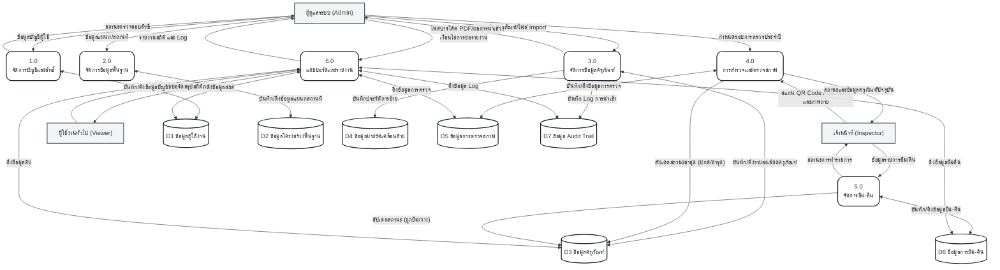

# แผนภาพกระแสข้อมูลระดับ 0 (Data Flow Diagram - DFD Level 0)

แผนภาพ **DFD Level 0** (หรือ Diagram 0) แสดงกระบวนการหลักของระบบ (Main Processes) ทั้งหมด 6 กระบวนการ พร้อมทั้งแสดงความสัมพันธ์และการไหลของข้อมูลระหว่างหน่วยงานภายนอก (External Entities) และแหล่งเก็บข้อมูล (Data Stores)

## 📊 DFD Level 0: ระบบบริหารจัดการครุภัณฑ์

---

## 📝 คำอธิบายทิศทางการไหลของข้อมูล (Data Flow Explanation)

**การปฏิสัมพันธ์กับผู้ดูแลระบบ (Admin):**
* ทำหน้าที่จัดการข้อมูลทุกส่วน ตั้งแต่บัญชีผู้ใช้ (Process 1.0) โครงสร้างพื้นฐาน (Process 2.0) และฐานข้อมูลครุภัณฑ์หลัก (Process 3.0) 
* เมื่อมีอุปกรณ์ใหม่ สามารถส่งข้อมูลแบบฟอร์ม หรือไฟล์ Excel เข้าไปในระบบ และรับไฟล์บาร์โค้ด PDF กลับออกมาแปะที่อุปกรณ์ได้
* ร้องขอและเรียกดูรายงาน (Process 6.0) รวมถึงประวัติการใช้งาน (Audit Trail) เชิงลึกได้

**การปฏิสัมพันธ์กับเจ้าหน้าที่ (Inspector):**
* ใช้งานผ่าน Mobile App เป็นหลัก โดยส่งคำขอตรวจสอบข้อมูลผ่านการสแกน QR Code (Process 4.0) และส่งผลการประเมินสภาพ/รูปถ่ายเข้าไปบันทึกใน Data Store D5
* ส่งข้อมูลคำขอการยืม-คืน (Process 5.0) ของผู้ใช้เข้าไปบันทึกใน Data Store D6 พร้อมเปลี่ยนสถานะครุภัณฑ์ในแฟ้ม D3 แบบอัตโนมัติ

**การปฏิสัมพันธ์กับผู้บริหาร/ผู้ใช้ทั่วไป (Viewer):**
* ไม่มีการแก้ไขข้อมูล (Write) แต่จะทำการส่งเงื่อนไขเพื่อเรียกดูข้อมูล (Read) ผ่านหน้า Dashboard (Process 6.0) เพื่อดูยอดรวมสถิติต่างๆ

**การไหลเวียนภายในกับแหล่งเก็บข้อมูล (Data Stores):**
* **D3 ข้อมูลครุภัณฑ์** ถือเป็นศูนย์กลาง (Hub) ที่กระบวนการ P3, P4 และ P5 ต้องเข้าถึงเพื่ออัปเดตสถานะ (เช่น จาก "ปกติ" เป็น "ชำรุด" หรือ "ถูกยืม")
* กระบวนการ **P6 แดชบอร์ดและรายงาน** จะทำการดึงข้อมูล (Read Only) จาก Data Store ทุกตัว (D1, D3, D5, D6, D7) เพื่อนำมาสรุปผลและออกรายงาน โดยไม่ไปแก้ไขข้อมูลใดๆ
