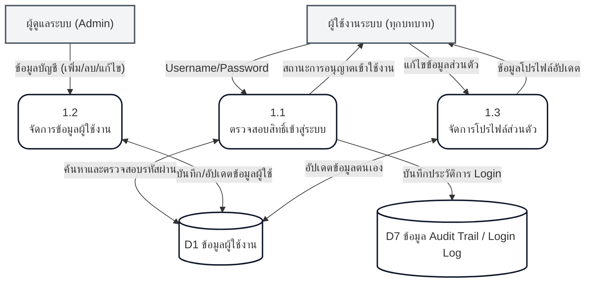
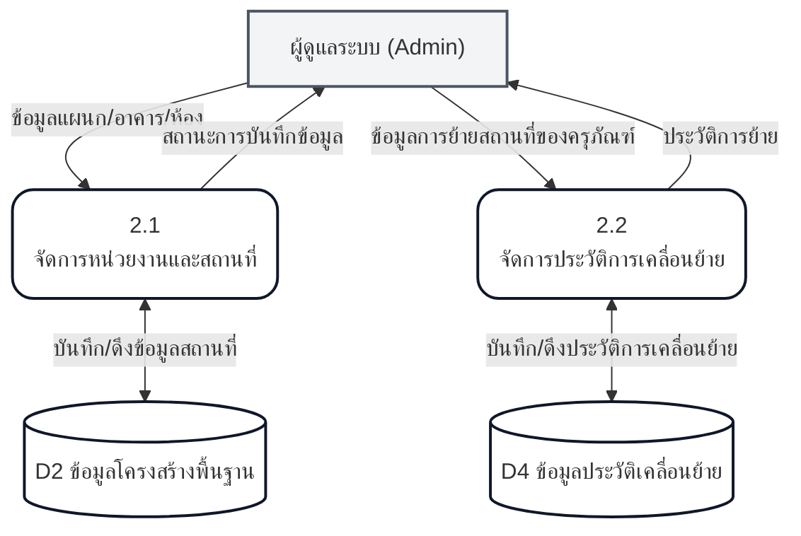
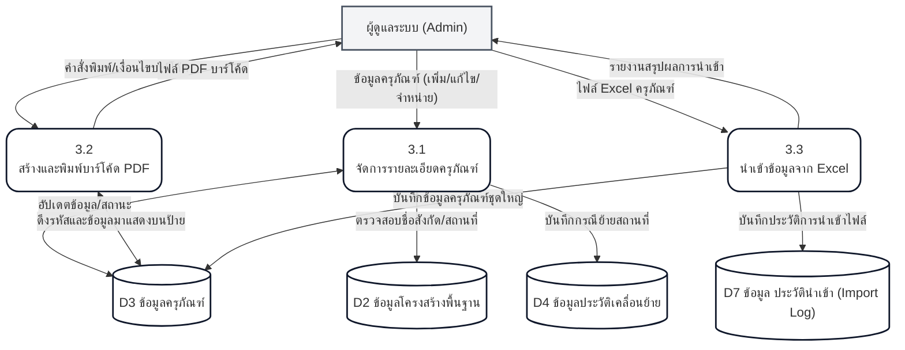
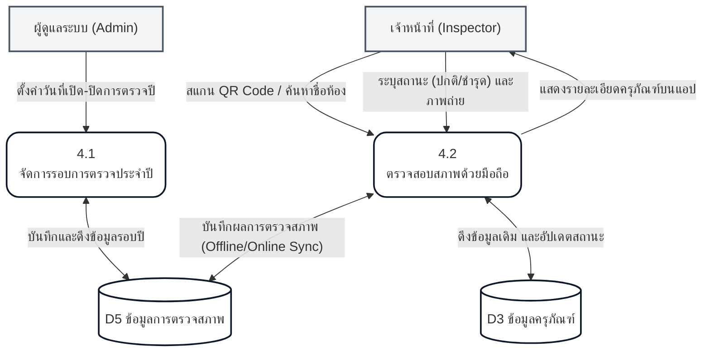
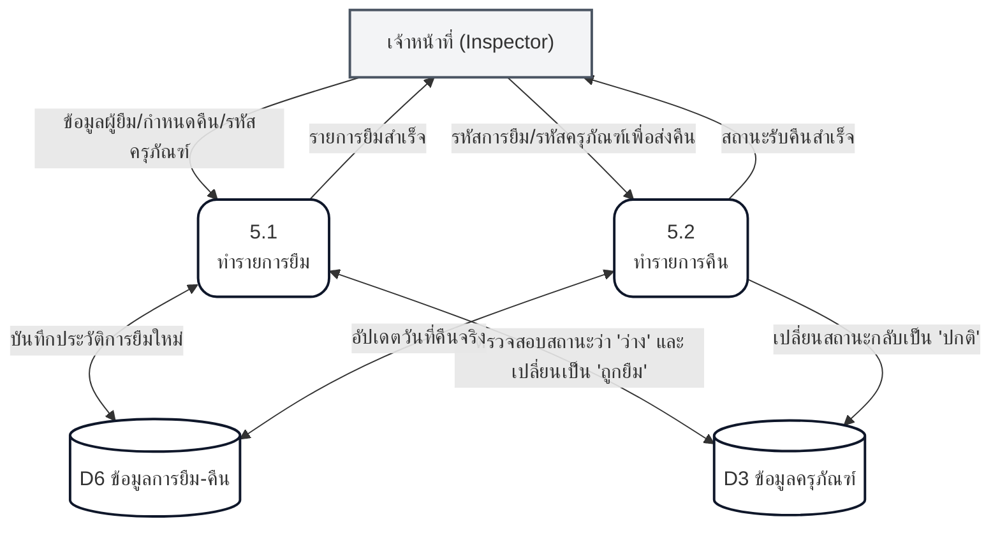
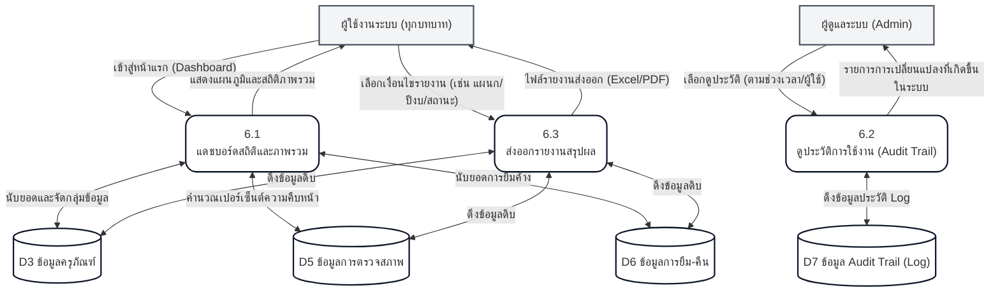

# แผนภาพกระแสข้อมูลระดับ 1 (Data Flow Diagram - DFD Level 1)

แผนภาพ **DFD Level 1** เป็นการเจาะลึกลงไปในแต่ละกระบวนการหลัก (จาก DFD Level 0) เพื่อดูการทำงานย่อยภายใน (Sub-processes) และการไหลของข้อมูลระหว่างกระบวนการย่อยกับ Data Store

เอกสารฉบับนี้รวบรวม DFD Level 1 ของกระบวนการหลักครบทั้ง 6 ส่วนของระบบ ได้แก่:

---

## 1. DFD Level 1 ของ Process 1.0 จัดการบัญชีและสิทธิ์

อธิบายการทำงานที่เกี่ยวข้องกับการเข้าใช้งานระบบ การจัดการบัญชีผู้ใช้ และการแก้ไขโปรไฟล์

---

## 2. DFD Level 1 ของ Process 2.0 จัดการข้อมูลพื้นฐาน

อธิบายกระบวนการจัดการข้อมูลอ้างอิงที่จำเป็นต้องใช้ในระบบ เช่น ข้อมูลแผนก อาคาร ห้อง และการเก็บประวัติเคลื่อนย้ายครุภัณฑ์

---

## 3. DFD Level 1 ของ Process 3.0 จัดการข้อมูลครุภัณฑ์

อธิบายกระบวนการจัดการข้อมูลครุภัณฑ์ ตั้งแต่การเพิ่ม/แก้ไข การสร้างบาร์โค้ด และการนำเข้าข้อมูลชุดใหญ่ผ่าน Excel

---

## 4. DFD Level 1 ของ Process 4.0 การสำรวจและตรวจสภาพ

อธิบายการทำงานของฝั่งแอปพลิเคชันมือถือในการตรวจสภาพครุภัณฑ์ประจำปี และการจัดการรอบปีของแอดมิน

---

## 5. DFD Level 1 ของ Process 5.0 จัดการยืม-คืน

อธิบายเวิร์กโฟลว์การยืม-คืนครุภัณฑ์ ซึ่งมีผลกระทบโดยตรงต่อสถานะความพร้อมใช้งาน (Availability) ของครุภัณฑ์ในระบบ

---

## 6. DFD Level 1 ของ Process 6.0 แดชบอร์ดและรายงาน

อธิบายกระบวนการรวบรวมข้อมูลดิบ (Read-only) จากหลายแหล่ง เพื่อประมวลผลออกมาเป็นแดชบอร์ดสถิติ และการส่งออกรายงาน

