# การวิเคราะห์และออกแบบระบบ (System Analysis Elements)

เอกสารส่วนนี้รวบรวมองค์ประกอบหลักสำหรับการเตรียมความพร้อมก่อนการออกแบบแผนภาพ Data Flow Diagram (DFD) โดยแบ่งออกเป็น 3 ส่วนหลัก ได้แก่ ขอบเขตของระบบ (Boundaries), รายการข้อมูล (Data) และรายการกระบวนการ (Processes)

---

## 1. List of Boundaries (ขอบเขตของระบบ / External Entities)
กลุ่มบุคคลหรือระบบภายนอกที่มีการรับส่งข้อมูล (มีปฏิสัมพันธ์) กับระบบบริหารจัดการครุภัณฑ์ ประกอบด้วย:

1. **ผู้ดูแลระบบ (Admin):** ผู้ใช้งานที่มีสิทธิ์สูงสุด ทำหน้าที่จัดการข้อมูลผู้ใช้ จัดการข้อมูลพื้นฐาน นำเข้าข้อมูลครุภัณฑ์จำนวนมาก กำหนดรอบการตรวจสอบประจำปี และดูประวัติการใช้งานระบบ (Audit Trail)
2. **เจ้าหน้าที่ (Inspector):** ผู้ใช้งานที่ปฏิบัติงานภาคสนามหรือดูแลสต็อก ทำหน้าที่หลักในการสแกนตรวจสภาพครุภัณฑ์ผ่านมือถือ (สแกน QR Code) และบันทึกรายการยืม-คืนครุภัณฑ์
3. **ผู้ใช้งานทั่วไป / ผู้บริหาร (Viewer):** ผู้ใช้งานที่เน้นการเรียกดูข้อมูล เข้าสู่ระบบเพื่อค้นหาสถานะครุภัณฑ์ หรือดูรายงานสรุปสถิติภาพรวมผ่านหน้าแดชบอร์ด

---

## 2. List of Data (รายการข้อมูล / Data Flows & Data Stores)
กลุ่มข้อมูลหลักที่ไหลเข้าและออกจากระบบ (Data In/Out) ซึ่งนำไปสู่การบันทึกลงในแฟ้มข้อมูล (Data Stores) ประกอบด้วย:

1. **ข้อมูลผู้ใช้งาน (User Data):** ข้อมูลบัญชีผู้ใช้, รหัสผ่าน, สิทธิ์การใช้งาน, ประวัติการ Login
2. **ข้อมูลโครงสร้างพื้นฐาน (Master Data):** ข้อมูลแผนก (Departments) และข้อมูลสถานที่ อาคาร ชั้น ห้อง (Locations)
3. **ข้อมูลรายละเอียดครุภัณฑ์ (Asset Data):** รายละเอียดครุภัณฑ์, หมายเลขซีเรียล, สถานะปัจจุบัน, รูปภาพ, บาร์โค้ด
4. **ข้อมูลการเคลื่อนย้าย (Movement Data):** ประวัติและหลักฐานการเปลี่ยนสถานที่จัดเก็บครุภัณฑ์
5. **ข้อมูลการตรวจสอบสภาพ (Inspection Data):** รอบกำหนดการตรวจสอบประจำปี, ผลการสแกนตรวจสภาพ (ปกติ/ชำรุด), ภาพถ่ายตอนตรวจ
6. **ข้อมูลการยืม-คืน (Borrow/Return Data):** วันที่ทำรายการยืม, ชื่อผู้ยืม, กำหนดคืน, วันที่คืนครุภัณฑ์จริง
7. **ข้อมูลระบบและหลักฐานการทำงาน (System Logs):** บันทึกประวัติการกระทำต่างๆ ในระบบ (Audit Trail), สรุปผลการนำเข้าข้อมูล (Import History)

---

## 3. List of Processes (รายการกระบวนการทำงาน)

แบ่งหมวดหมู่ตามฟังก์ชันหลักของระบบ (Process Hierarchy) เพื่อนำไปใช้วาดแผนภาพ DFD ต่อไป

### 📋 รายการกระบวนการแบบจัดหมวดหมู่

**Process 1: จัดการบัญชีและสิทธิ์**
* 1.1 ตรวจสอบสิทธิ์เข้าสู่ระบบ (Login & Authentication)
* 1.2 จัดการข้อมูลผู้ใช้งาน (Manage Users)
* 1.3 จัดการโปรไฟล์ส่วนตัว (Manage Profile)

**Process 2: จัดการข้อมูลพื้นฐาน**
* 2.1 จัดการหน่วยงานและสถานที่ (Manage Departments & Locations)
* 2.2 จัดการประวัติการเคลื่อนย้าย (Manage Asset History)

**Process 3: จัดการข้อมูลครุภัณฑ์**
* 3.1 จัดการรายละเอียดครุภัณฑ์
  * 3.1.1 เพิ่มข้อมูลใหม่
  * 3.1.2 แก้ไขข้อมูล
  * 3.1.3 ลบ/แทงจำหน่าย
* 3.2 สร้างและพิมพ์บาร์โค้ด PDF (Generate Barcodes)
* 3.3 นำเข้าข้อมูลจาก Excel (Import Assets)
  * 3.3.1 ตรวจสอบฟอร์แมตไฟล์
  * 3.3.2 บันทึกข้อมูลครุภัณฑ์
  * 3.3.3 สรุปประวัติการนำเข้า

**Process 4: การสำรวจและตรวจสภาพ**
* 4.1 จัดการรอบการตรวจประจำปี (Annual Audit Setup)
* 4.2 ตรวจสอบสภาพด้วยมือถือ (Mobile Inspection)
  * 4.2.1 อ่าน QR Code / ค้นหาครุภัณฑ์
  * 4.2.2 ประเมินสถานะและถ่ายภาพ
  * 4.2.3 ซิงค์ข้อมูลระหว่างเครื่องกับเซิร์ฟเวอร์ (Offline/Online Sync)

**Process 5: จัดการยืม-คืน**
* 5.1 ทำรายการยืม (Borrow)
  * 5.1.1 ตรวจสอบสถานะครุภัณฑ์ (ต้องว่าง)
  * 5.1.2 บันทึกข้อมูลผู้ยืมและกำหนดคืน
* 5.2 ทำรายการคืน (Return)
  * 5.2.1 บันทึกวันที่คืนจริง
  * 5.2.2 ปรับปรุงสถานะครุภัณฑ์กลับเป็นปกติ

**Process 6: แดชบอร์ดและรายงาน**
* 6.1 แดชบอร์ดสถิติและภาพรวม (Dashboard Overview)
* 6.2 ดูประวัติการใช้งานระบบ (Audit Trail)
* 6.3 ส่งออกรายงานสรุปผล (Export Reports)
  * 6.3.1 ประมวลผลและกรองข้อมูลตามเงื่อนไข (ปีงบประมาณ/แผนก)
  * 6.3.2 สร้างไฟล์ส่งออกเป็น Excel/PDF

---

### 📊 แผนภาพแสดงโครงสร้าง (Process Hierarchy Chart)

```mermaid
flowchart TD
    P0["0. ระบบบริหารจัดการครุภัณฑ์"]
    
    P0 --- P1["1. จัดการบัญชีและสิทธิ์"]
    P0 --- P2["2. จัดการข้อมูลพื้นฐาน"]
    P0 --- P3["3. จัดการข้อมูลครุภัณฑ์"]
    P0 --- P4["4. การสำรวจและตรวจสภาพ"]
    P0 --- P5["5. จัดการยืม-คืน"]
    P0 --- P6["6. แดชบอร์ดและรายงาน"]

    %% Process 1
    P1 --- P1_1["1.1 ตรวจสอบสิทธิ์เข้าสู่ระบบ"]
    P1 --- P1_2["1.2 จัดการข้อมูลผู้ใช้งาน"]
    P1 --- P1_3["1.3 จัดการโปรไฟล์ส่วนตัว"]

    %% Process 2
    P2 --- P2_1["2.1 จัดการหน่วยงาน/สถานที่"]
    P2 --- P2_2["2.2 จัดการประวัติการเคลื่อนย้าย"]

    %% Process 3
    P3 --- P3_1["3.1 จัดการรายละเอียดครุภัณฑ์"]
    P3 --- P3_2["3.2 สร้างและพิมพ์บาร์โค้ด PDF"]
    P3 --- P3_3["3.3 นำเข้าข้อมูลจาก Excel"]

    %% Process 4
    P4 --- P4_1["4.1 จัดการรอบตรวจประจำปี"]
    P4 --- P4_2["4.2 ตรวจสอบสภาพด้วยมือถือ"]

    %% Process 5
    P5 --- P5_1["5.1 ทำรายการยืม"]
    P5 --- P5_2["5.2 ทำรายการคืน"]

    %% Process 6
    P6 --- P6_1["6.1 แดชบอร์ดสถิติและภาพรวม"]
    P6 --- P6_2["6.2 ดูประวัติการใช้งานระบบ"]
    P6 --- P6_3["6.3 ส่งออกรายงานสรุปผล"]

    %% Styling
    classDef main fill:#2C3E50,stroke:#fff,stroke-width:2px,color:#fff;
    classDef level1 fill:#2980B9,stroke:#fff,stroke-width:2px,color:#fff;
    classDef level2 fill:#1ABC9C,stroke:#fff,stroke-width:2px,color:#fff;
    
    class P0 main;
    class P1,P2,P3,P4,P5,P6 level1;
    class P1_1,P1_2,P1_3,P2_1,P2_2,P3_1,P3_2,P3_3,P4_1,P4_2,P5_1,P5_2,P6_1,P6_2,P6_3 level2;
```

*(หมายเหตุ: แผนภาพนี้ลดทอนระดับย่อย 3.x.x ออกเพื่อไม่ให้ภาพกว้างเกินไป โดยให้ดูรายละเอียด Process ระดับย่อยจากรายการ List of Processes ด้านบนแทน)*
